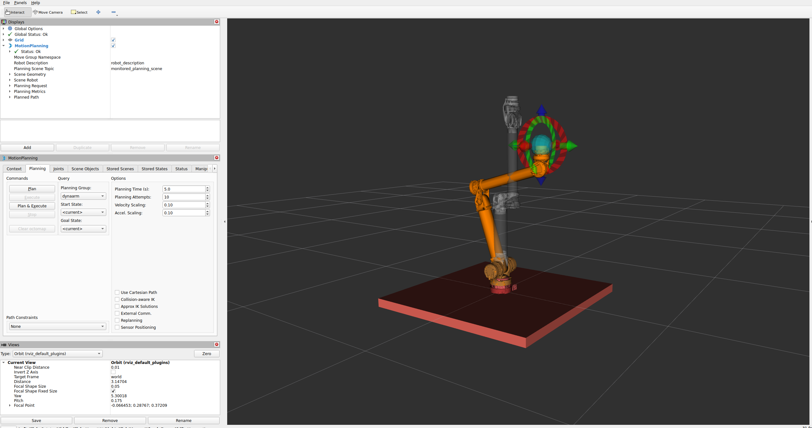

# dynaarm_single_example

This is the most basic example how to integrate the DynaArm into any application.




### Content

#### 1. Integrate and extend the [dynaarm_description](https://github.com/Duatic/dynaarm_description) in your own application.
In this example the arm is placed on a virtual table. [See the code](./dynaarm_single_example_description/urdf/dynaarm_single_example.urdf.xacro)

Run the basic visualisation of the extended model:
```
ros2 launch dynaarm_single_example_description view.launch.py
```

#### 2. How to setup [MoveIt2](https://moveit.picknik.ai/main/index.html) with the DynaArm in your application.

The configuration was generated with the [MoveIt Setup Assistant](https://moveit.picknik.ai/main/doc/examples/setup_assistant/setup_assistant_tutorial.html).

Run the MoveIt example:
```
ros2 launch dynaarm_single_example_moveit_config moveit.launch.py
```

#### 3. How to configure the description

Choosing between "real" hardware and "mock" hardware is done by simply running a different configuration of the xacro model which then configures ros2control appropriately.

See the [`real.launch.py`](./dynaarm_single_example/launch/real.launch.py) in contrast to the [`mock.launch.py`](./dynaarm_single_example/launch/mock.launch.py)

Both launch files contain a vast variety of configuration options.
For starting the example with real hardware you will need to at least configure the correct ethercat bus.

Example if the ethercat bus is plugged to `eth0`
```
ros2 launch dynaarm_single_example real.launch.py ethercat_bus:=eth0
```
